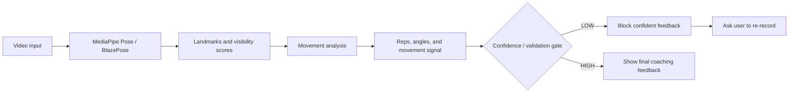

# Confidence and Validation Layer

Phase 5 adds a confidence and validation gate before coaching feedback is shown. The implementation uses two levels of evidence:

1. Pose/data-quality evidence from MediaPipe landmarks and visibility scores.
2. Analysis-confidence evidence from the movement-analysis output, including detected reps and movement-signal range.

The actual implemented flow is:

```text
Video
    -> MediaPipe Pose / BlazePose
    -> landmarks + visibility
    -> movement analysis
    -> reps + angles + movement signal
    -> confidence / validation gate
        -> LOW: block confident feedback and ask user to re-record
        -> HIGH: allow final coaching feedback
```



Figure 1. Phase 5 architecture with confidence validation after movement analysis and before coaching feedback.

The gate does not change the selected pose model, train a classifier, or modify the Phase 4 movement-analysis rules. It checks whether the available visual and movement evidence is strong enough to present confident coaching feedback.

## Structured Output

The confidence layer returns:

| Field | Meaning |
| --- | --- |
| `confidence_status` | `HIGH` or `LOW` |
| `usable_frame_rate` | Percentage of processed frames where MediaPipe detected a pose |
| `required_joint_availability` | Percentage of frames where required exercise joints were visible |
| `angle_calculability_rate` | Percentage of frames where the required joint angle could be calculated |
| `dropout_rate` | Rate of transitions from usable landmarks to unusable landmarks |
| `movement_signal_range` | P90-P10 range of the relevant joint-angle signal |
| `reason_codes` | Machine-readable reasons for low confidence |
| `user_message` | Human-readable re-record guidance |

Table 1. Confidence-gate output fields.

## Required Landmarks

For squat, either the left or right side must provide:

```text
shoulder, hip, knee, ankle
```

For bicep curl, either the left or right side must provide:

```text
shoulder, elbow, wrist
```

MediaPipe visibility must be at least `0.5` for a landmark to count as reliable.

## Thresholds

| Rule | Threshold |
| --- | ---: |
| Minimum processed frames | 15 |
| Minimum pose detection rate | 0.70 |
| Minimum required-joint availability | 0.65 |
| Minimum angle calculability rate | 0.65 |
| Maximum tracking dropout rate | 0.25 |
| Minimum squat movement signal range | 10 degrees |
| Minimum bicep-curl movement signal range | 20 degrees |

Table 2. Phase 5 confidence thresholds.

These thresholds are intentionally conservative. The gate should block clearly weak evidence, such as missing joints, no repetitions, or extremely small movement signals, without pretending the final feedback is reliable.

## Reason Codes

| Reason code | Meaning |
| --- | --- |
| `TOO_FEW_FRAMES` | The video is too short for reliable analysis |
| `LOW_POSE_DETECTION` | MediaPipe did not detect the body in enough frames |
| `LOW_REQUIRED_JOINT_AVAILABILITY` | Required exercise joints were not visible enough |
| `LOW_ANGLE_CALCULABILITY` | Required joint angles could not be calculated often enough |
| `TRACKING_DROPOUT` | Pose tracking repeatedly dropped out |
| `NO_REPS_DETECTED` | The movement analyser found no valid repetitions |
| `INSUFFICIENT_MOVEMENT_SIGNAL` | The relevant joint angle barely changed |

Table 3. Low-confidence reason codes.

## Human-In-The-Loop Behaviour

If confidence is low, the app does not show confident coaching feedback. Instead it shows a specific re-record message. Examples:

```text
Analysis confidence is low because the full body was not clearly visible. Please record again with shoulders, hips, knees, and ankles in frame.
```

```text
Analysis confidence is low because no valid repetitions were detected. Please record again with the full movement visible.
```

This reduces error propagation: uncertain pose data should not become confident movement analysis, and uncertain movement analysis should not become coaching advice.

## High Confidence vs Accuracy

High confidence does not mean high accuracy. It means the available visual and movement evidence is usable enough for analysis. A high-confidence video may still have repetition-count errors.

For example, `vid01`, `vid09`, `vid10`, and `vid15` passed the confidence gate because the required landmarks and movement signal were usable, but their Phase 4 repetition counts were still imperfect. These cases should be discussed as movement-analysis accuracy limitations, not as low-quality input failures.

The main blocked example remains `vid23`: it received LOW confidence because it had 0 detected reps, a movement signal range of only 6.6 degrees, and the reason codes `NO_REPS_DETECTED` and `INSUFFICIENT_MOVEMENT_SIGNAL`.

## Known Limitations

- A high confidence result means the analysis evidence passed the validation rules. It does not guarantee perfect rep counting.
- A low confidence result can be a false reject if the user performs a very small but intentional movement.
- The movement-signal thresholds are simple and may need revision after more volunteer data is collected.
- Confidence gating improves safety of feedback but does not replace full technical evaluation.

## Next Phase

The next phase is Phase 6 - Compare Speech-to-Text Models / Whisper variants.
