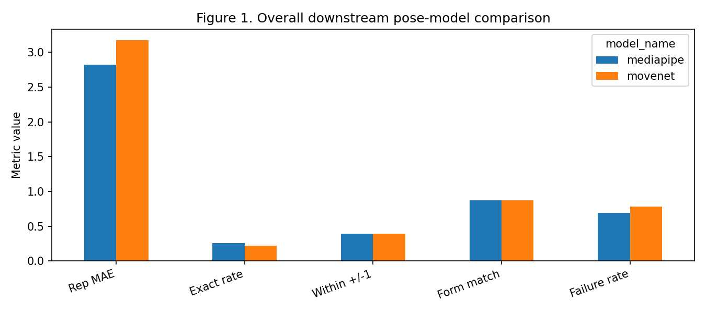
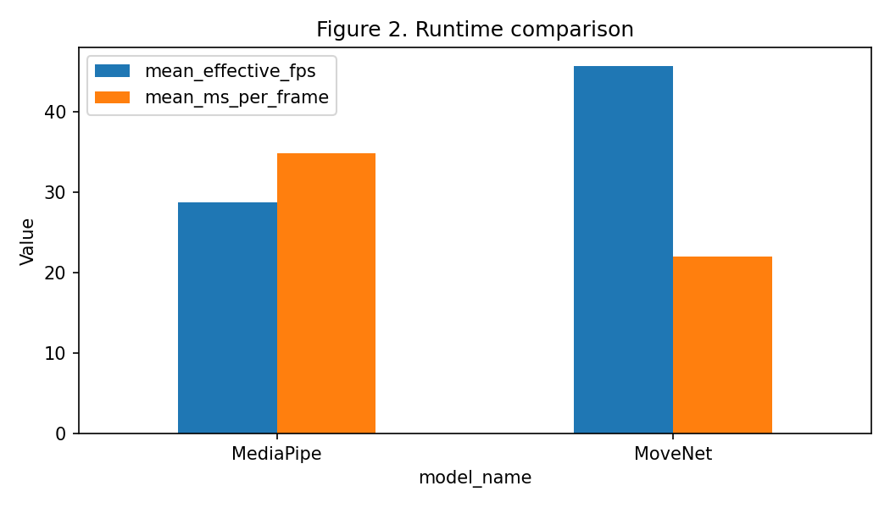
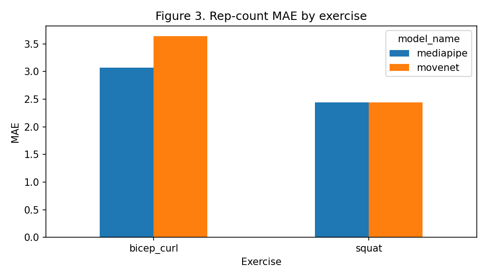
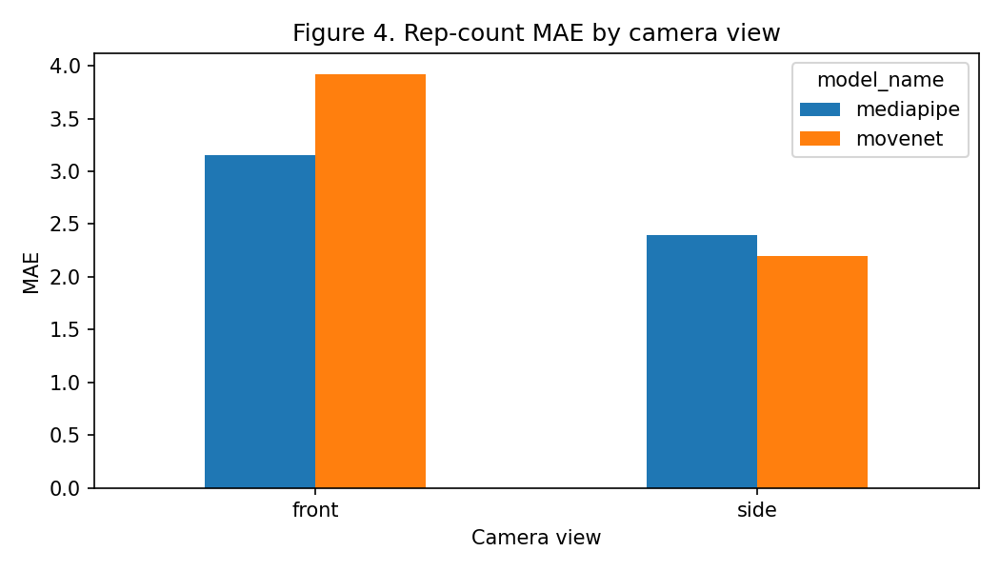

# Pose Model Evaluation Results

Phase 3 compared MediaPipe Pose / BlazePose with MoveNet using the frozen Phase 2 benchmark. Both models were evaluated on the same 23 full volunteer videos, with `frame-step=3`, the same expected repetition counts, the same verified labels, and the same downstream angle/repetition logic.

The benchmark uses the canonical full-video copies under `dataset/raw/` because two original external source paths could not be decoded by OpenCV, while the preserved canonical copies decoded correctly. The benchmark still represents the same 23 original volunteer recordings, not repetition clips or augmented data.

## Model Setup

**Table 1. Candidate pose models and implementation details.**

| Model | Variant | Runtime/library | Source | Preprocessing |
| --- | --- | --- | --- | --- |
| MediaPipe Pose / BlazePose | `mediapipe.solutions.pose.Pose`, model complexity 1 | MediaPipe | Bundled with `mediapipe` | BGR frame converted to RGB; MediaPipe internal preprocessing |
| MoveNet | SinglePose Lightning TFLite float16 v4 | `ai-edge-litert` | TensorFlow Hub | RGB frame resized with padding to `192x192`, then coordinates unpadded to original frame |

## Overall Results

**Table 2. Overall primary benchmark results on 23 source videos.**

| Metric | MediaPipe | MoveNet |
| --- | ---: | ---: |
| Expected reps | 230 | 230 |
| Detected reps | 185 | 187 |
| Rep-count MAE | 2.8261 | 3.1739 |
| Exact-count rate | 0.2609 | 0.2174 |
| Within +/-1 rate | 0.3913 | 0.3913 |
| Form-label match rate | 0.8696 | 0.8696 |
| Pose detection coverage | 0.9952 | 1.0000 |
| Required-joint availability | 0.6448 | 0.9324 |
| Angle calculability | 0.9952 | 0.9958 |
| Failure rate | 0.6957 | 0.7826 |
| Effective FPS | 27.3205 | 34.7589 |

## Exercise And View Results

**Table 3. Rep-count MAE by exercise.**

| Exercise | MediaPipe MAE | MoveNet MAE |
| --- | ---: | ---: |
| Bicep curl | 3.0714 | 3.6429 |
| Squat | 2.4444 | 2.4444 |

**Table 4. Rep-count MAE by camera view.**

| View | MediaPipe MAE | MoveNet MAE |
| --- | ---: | ---: |
| Front | 3.1538 | 3.9231 |
| Side | 2.4000 | 2.2000 |

**Table 5. Rep-count MAE by form label.**

| Form label | MediaPipe MAE | MoveNet MAE |
| --- | ---: | ---: |
| Correct | 2.4667 | 2.6667 |
| Half range | 3.0000 | 3.8333 |
| Shallow | 5.0000 | 5.0000 |

## Preliminary Pose-Model Robustness Comparison

The preliminary pose-model robustness comparison used four representative source videos and applied the same transformations to both models: reduced brightness, slight crop/zoom, and slight rotation. These results are separate from the primary 23-video benchmark and do not represent full project robustness testing, which remains later work.

**Table 6. Robustness summary.**

| Model/transformation | Mean coverage | Mean joint availability | Mean abs rep error | Mean FPS |
| --- | ---: | ---: | ---: | ---: |
| MediaPipe baseline | 0.98 | 0.76 | 1.50 | 26.44 |
| MediaPipe reduced brightness | 0.98 | 0.73 | 1.75 | 26.23 |
| MediaPipe crop/zoom | 0.97 | 0.74 | 1.50 | 25.26 |
| MediaPipe slight rotation | 0.97 | 0.74 | 1.75 | 26.05 |
| MoveNet baseline | 1.00 | 0.88 | 3.25 | 53.12 |
| MoveNet reduced brightness | 1.00 | 0.90 | 3.50 | 52.33 |
| MoveNet crop/zoom | 1.00 | 0.92 | 2.75 | 51.82 |
| MoveNet slight rotation | 1.00 | 0.87 | 3.75 | 50.35 |

## Selection

Selected pose model: **MediaPipe Pose / BlazePose**.

MediaPipe Pose / BlazePose was selected for the final movement-analysis pipeline because it achieved lower repetition-count error and a higher exact-count rate on the primary benchmark. These application-level measures were prioritised because accurate repetition analysis is central to the fitness-coaching objective. MoveNet demonstrated substantially higher required-joint availability and processing speed, but these advantages did not translate into better overall repetition-count or form-label performance on this project dataset. The selection is therefore a task-specific trade-off rather than evidence that MediaPipe is universally superior.

MoveNet was not selected for the final movement-analysis pipeline at this stage because its advantages in speed and joint availability did not translate into better repetition counting or form-label matching on the project dataset.

## Main Limitations

- The primary pose benchmark is limited to 23 original source videos from four independent participants. Although the broader project dataset has been expanded through repetition segmentation and augmentation, participant diversity remains limited, which restricts the generalisability of the pose-model comparison.
- Both models struggled with some shallow squat cases.
- Bicep curl videos remained harder than squat videos for repetition counting.
- The form-label match is based on rule thresholds, not a trained classifier.
- The preliminary pose-model robustness comparison was intentionally small and should not be treated as full project robustness testing or as a new training/evaluation dataset.

## Next Step

The next phase is **Phase 4 — Finalise Movement Analysis using the selected MediaPipe Pose / BlazePose model**.

Phase 4 should retain the existing explainable rule-based squat and bicep-curl analysis, including repetition counting, squat correct/deep versus shallow analysis, bicep curl full-range versus half-range analysis, and movement features/angles. Classical classifiers such as Random Forest or SVM remain optional later work and are not the next core phase.
